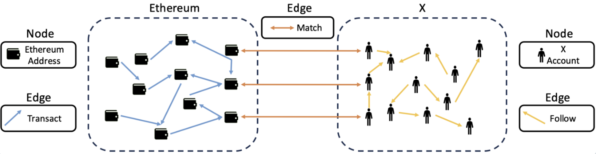

# EX-Graph
EX-Graph is a rich dataset containing Ethereum transaction data and X data. With a focus on bridging the gap between anonymous Ethereum activities and the leading social media X's information, it's specifically designed to facilitate various tasks including Ethereum link prediction, wash-trading addresses detection, and matching link prediction between Ethereum addresses and X accounts. By integrating these two different dimensions, EX-Graph provides an on-chain and off-chain resource for researchers and analysts to explore the complex dynamics of Ethereum.

## Overview



Additionally, we've made the EX-Graph dataset accessible through a dedicated website [EX-Graph](https://EX-Graph.deno.dev/). Here, you are welcomed to upload and compare your experiment results on our leaderboard.

## Table of Contents
- [Dataset Overview](#dataset-overview)
- [Dataset Schema](#dataset-schema)
- [Getting Started](#getting-started)
  - [Installation](#installation)
  - [Requirements](#requirements)
  - [Dataset Loading](#dataset-loading)
- [Using EX-Graph](#using-EX-Graph)
  - [Ethereum Link Prediction](#ethereum-link-prediction)
  - [Wash Trading Address Detection](#wash-trading-address-detection)
  - [Matching Link Prediction](#matching-link-prediction)
- [License](#license)
- [Acknowledgement](#acknowledgement)

## Dataset Overview
EX-Graph dataset consists of several components:

- `X Graph`: X accounts and their following relationships.
- `Ethereum Graph`: Ethereum addresses and their transaction records.
- `Ethereum Graph with X features`: A DGL graph contains Ethereum addresses and their transaction records, as well as Ethereum addresses features got from both Ethereum and matched-X accounts, it is used for Ethereum link prediction task.
- `Wash-trading Addresses Detection Training Graph`: Training graph used for wash-trading addresses detection task.
- `Wash-trading Addresses Detection Validation Graph`: Validation graph used for wash-trading addresses detection task.
- `Wash-trading Addresses Detection Test Graph`: Test graph used for wash-trading addresses detection task.
- `Matching Link Prediction Graph`: DGL graph used for matching link prediction task.
- `ethereum_link_prediction`: Folder contains models to run Ethereum link prediction experiment and train, validation, test edge indices pickle files.
- `wash_trading_address_detection`: Folder contains code of models to run wash trading address detection experiment.
- `matching_link_prediction`: Folder contains models to run matching link prediction experiment and train, validation, test edge indices pickle files.
- `X_matching.csv`: X accounts and the Ethereum addresses matched with them. We did anonymization operations so that you can see the X numerical id matching with Ethereum addresses without leaking any personal information.
- `dune_wash_trade_tx.csv`: Wash-trading transactions downloaded from Dune.


## Dataset Schema
We present the original datasets and datasets tailored for use in three distinct tasks. For each dataset, a Google Drive link is provided for easy access and download.
| Dataset                                         | #Nodes            | #Edges            | Node Features                        | Edge Features                              |
|------------------------------------------------|------------------|------------------|-------------------------------------|--------------------------------------------|
| [X Graph](https://drive.google.com/file/d/1n3lFNCsl-6O_ew9tD9HUic-ld4j2QxeX/view?usp=sharing)                                  | 1,103,509|3,768,281| n.a.                      | n.a.                            |
| [Ethereum Graph](https://drive.google.com/file/d/1VWUGTUniv7-uDISXvJcMLE4OMCtQFPn6/view?usp=sharing)                                 | 2,610,465| 29,585,858| n.a.                     | from_address, to_address, weight, block_number       |
| [Ethereum Graph with X features](https://drive.google.com/file/d/1q3KX_b3M2wImFvFMP-15CcPKdVOeuSw-/view?usp=sharing)           |1,709,575 |13,170,869 | X_features, ethereum_features, ethereum_X_combined_features | from_address, to_address, weight, block_number                          |
| [Wash-trading Addresses Detection Training Graph](https://drive.google.com/file/d/1k2pkqlvA1wcamvgFSyZvmSSz3PRsG8Ie/view?usp=sharing)           | 1,268,607| 8,276,446| ethereum_features, X_semantic_features, X_structure_features, ethereum_X_combined_features, wash_trading_label | n.a.                          |
| [Wash-trading Addresses Detection Validation Graph](https://drive.google.com/file/d/1CEIA9gzX9zjBshhWjNfm_Zx6g9wMybzb/view?usp=sharing)           | 452,930| 1,182,349| ethereum_features, X_semantic_features, X_structure_features, ethereum_X_combined_features, wash_trading_label | n.a.                         |
| [Wash-trading Addresses Detection Test Graph](https://drive.google.com/file/d/1aHpUtOu4OktcffnWi_IHLBB0miGlTYuO/view?usp=sharing)           | 711,084| 2,364,700| ethereum_features, X_semantic_features, X_structure_features, ethereum_X_combined_features, wash_trading_label | n.a.                          |
| [Matching Link Prediction Graph](https://drive.google.com/file/d/16_p85_R_PQtDzystILfmj1YTXJSm7-1f/view?usp=sharing)           | 2,833,659| 18,433,366| combined_features | n.a.                          |


## Getting Started
### Installation

1. Download this repository and extract the datasets to a desired location.
2. Create a Conda environment using the provided `environment.yml` file, which includes the requirements to run experiments in this repository. Run:

   ```
   conda env create -f environment.yml
   ```

### Requirements
We list main requirements of this repository below. For full requirements, please refer to the provided `environment.yml` file

- dgl==1.1.0
- torch==2.0.0+cu117
- torch-cluster==1.6.1+pt20cu117
- torch-geometric==2.3.0
- torch-scatter==2.1.1+pt20cu117
- torch-sparse==0.6.17+pt20cu117
- torch-spline-conv==1.2.2+pt20cu117
- torchaudio==2.0.1+cu117
- torchmetrics==0.11.4
- torchvision==0.15.1+cu117
- transformers==4.30.2

### Dataset Loading

We suppose that you have downloaded the datasets to the corresponding task's folders. Then, you can use the following command to load the data in the pkl format.

e.g. For Ethereum link prediction task, you have downloaded Ethereum Graph with X features in the folder. Then you can use the following command to load the dataset

```
import dgl
import pickle as pkl
with open('ethereum_graph_with_X_features.pkl', 'rb') as f:
    ethereum_graph_with_X_features = pkl.load(f)
```


## Using EX-Graph

This section details how to using EX-Graph to run benchmark baselines. We explain experiments Ethereum link prediction, wash-trading addresses detection, matching link prediction one by one.

### Ethereum Link Prediction
1. Navigate to ethereum_link_prediction folder, and download [Ethereum Graph with X features](https://drive.google.com/file/d/1q3KX_b3M2wImFvFMP-15CcPKdVOeuSw-/view?usp=sharing) to this folder. 
2. Each experiment code file is named as `model_wo/with_X.py`. `wo` means this experiment does not consider X features. `with` means this experiment considers X features. For example, if you want to run clusterGCN model considering X features in Ethereum link prediction, the command is as below:

    ``` 
    python clusterGCN_with_X.py
    ```

### Wash-trading Addresses Detection
1. Navigate to wash_trading_address_detection folder, and download the wash trading graphs: [Wash-trading Addresses Detection Training Graph](https://drive.google.com/file/d/1k2pkqlvA1wcamvgFSyZvmSSz3PRsG8Ie/view?usp=sharing), [Wash-trading Addresses Detection Validation Graph](https://drive.google.com/file/d/1CEIA9gzX9zjBshhWjNfm_Zx6g9wMybzb/view?usp=sharing), [Wash-trading Addresses Detection Test Graph](https://drive.google.com/file/d/1aHpUtOu4OktcffnWi_IHLBB0miGlTYuO/view?usp=sharing) to this folder. 
2. Each experiment code file is named as `model_wo/with_X.py`. `wo` means this experiment does not consider X features. `with` means this experiment considers X features. For example, if you want to run GCN model considering X features, the command is as below:
  
    ``` 
    python GCN_with_X.py
    ```

### Matching Link Prediction
1. Navigate to matching_link_prediction folder, and download [Matching Link Prediction Graph](https://drive.google.com/file/d/16_p85_R_PQtDzystILfmj1YTXJSm7-1f/view?usp=sharing) to this folder. 
2. Each experiment code file is named as `model.py`. For example, if you want to run GCN model on this matching link prediction, the command is as below:
   
    ``` 
    python GCN.py
    ```

## License
This dataset is under license CC BY-NC-SA.


## Acknowledgement
We thank [Ruochen Li](https://github.com/lirc572) for building the website and providing valuable suggestions for this repository.

## Star History

[](https://star-history.com/#Persdre/EX-Graph&Date)


